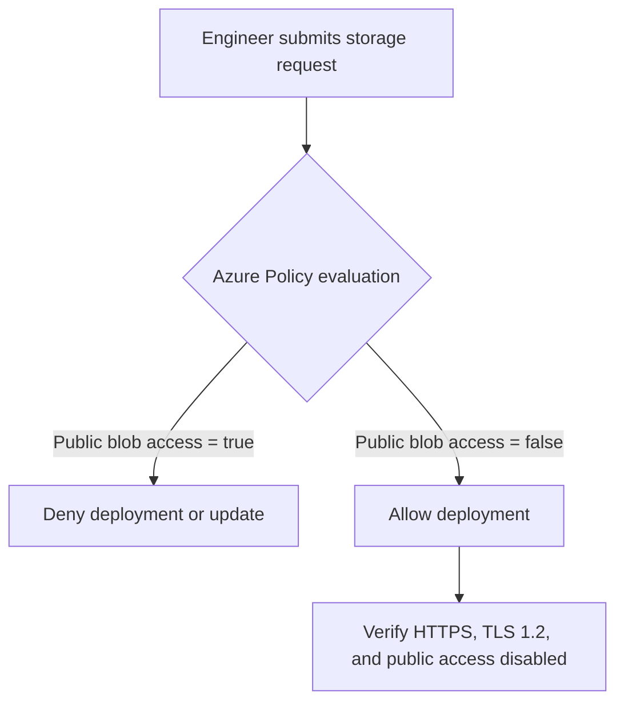
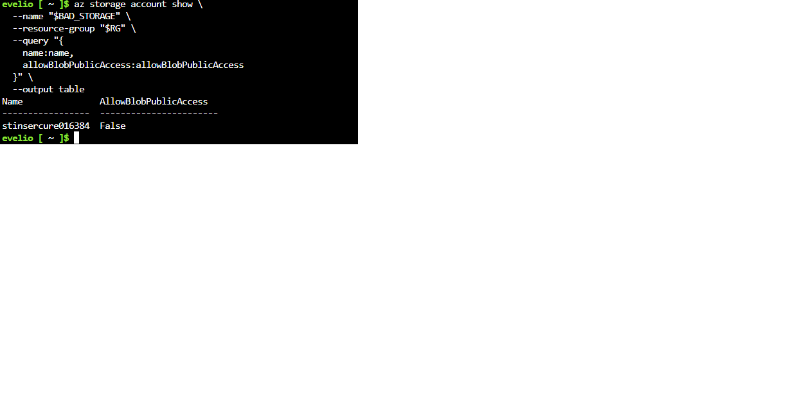
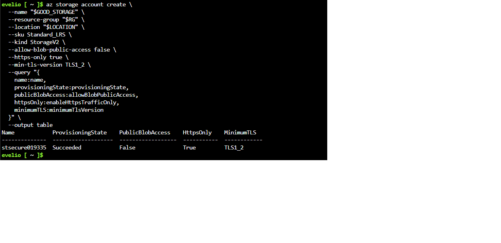

# Azure Policy Storage Guardrail

**Project date:** October 5, 2026  
**Focus:** Azure governance, policy-as-code, preventive controls, secure storage

## Executive Summary

This project implements a resource-group-level Azure Policy guardrail that prevents storage accounts from enabling anonymous public blob access. I deployed the built-in policy **Storage account public access should be disallowed** with the `Deny` effect, tested an intentionally insecure deployment, confirmed Azure blocked the request, then proved a compliant storage account could still be created.

The project demonstrates more than resource creation: it defines a security requirement, enforces it before deployment, performs both negative and positive tests, verifies that a denied update did not alter the resource, and documents troubleshooting from the implementation.

## Business Requirement

A company wants development teams to create Azure Storage accounts without allowing anonymous public blob access. Relying on engineers to remember the setting creates configuration-drift risk, so the control must be enforced automatically at deployment time.

### Success Criteria

- The policy is assigned only to the lab resource group.
- A storage account request with public blob access enabled is denied.
- A storage account with public blob access disabled deploys successfully.
- HTTPS-only traffic and TLS 1.2 are required on the compliant account.
- A denied update leaves the secure value unchanged.
- All resources can be removed with one cleanup command.

## Architecture and Control Flow



The assignment uses Azure's built-in policy definition ID:

`/providers/Microsoft.Authorization/policyDefinitions/4fa4b6c0-31ca-4c0d-b10d-24b96f62a751`

The resource-group scope follows least privilege: the lab control affects only the intended test boundary rather than the entire subscription.

## Threat and Abuse Considerations

| Risk | Control or limitation |
|---|---|
| Accidental anonymous blob exposure | Azure Policy denies storage accounts configured to permit public blob access. |
| Configuration drift after deployment | An update that attempts to enable the setting is also denied. |
| Weak transport configuration | The deployment command requires HTTPS and TLS 1.2. |
| Excessive policy scope | Assignment is limited to one dedicated resource group. |
| False sense of complete storage security | This control does not replace RBAC, network restrictions, private endpoints, logging, Defender for Cloud, or data classification. |

## Reproduce the Project

### Prerequisites

- An Azure subscription where you can create a resource group, policy assignment, and storage account
- Azure Cloud Shell or Azure CLI
- An authenticated session: `az login` when running locally
- Bash 4+

No earlier lab resources are required. Storage account names are generated automatically because Azure requires globally unique names.

### Deploy and Test

```bash
chmod +x scripts/deploy-and-test.sh scripts/cleanup.sh
./scripts/deploy-and-test.sh
```

The script performs these validations:

1. Creates a dedicated resource group.
2. resolves the full built-in policy resource ID;
3. assigns the policy with `Deny` enforcement;
4. intentionally attempts an insecure storage deployment and requires `RequestDisallowedByPolicy`;
5. deploys a compliant account;
6. attempts to enable public blob access on the compliant account and requires another denial;
7. verifies the secure value remains `false`.

To override defaults, set environment variables before running:

```bash
RG="rg-my-policy-lab" LOCATION="centralus" ./scripts/deploy-and-test.sh
```

Use lowercase letters and numbers for a custom `STORAGE_NAME`, with 3–24 total characters.

## Validation Evidence

### Negative Test

The insecure create and update requests returned:

```text
(RequestDisallowedByPolicy) Resource was disallowed by policy.
Reason: Public blob access is prohibited by the security baseline.
```

The public repository intentionally contains a concise sanitized excerpt instead of the full error output because Azure embeds the subscription ID in several policy-evaluation resource paths.

### Secure Value Preserved

After the denied update, `allowBlobPublicAccess` remained `false`:



### Positive Test

The compliant storage account reached `Succeeded` with public blob access disabled, HTTPS-only enabled, and TLS 1.2 configured:



## Troubleshooting Findings

The implementation produced several realistic CLI failures:

| Symptom | Root cause | Resolution |
|---|---|---|
| `printf: D: invalid format character` | `%06D` used an invalid uppercase format specifier. | Use `%06d`, or avoid formatting by generating the suffix in the script. |
| `crete is misspelled` | `az group crete` contained a command typo. | Use `az group create`. |
| A resource group named `SRG` was created | The literal `"SRG"` was passed instead of the variable `"$RG"`. | Quote variable expansions and verify them before creation. The accidental group was deleted. |
| Required `--name` argument missing | Backslashes and arguments were entered on one malformed line. | Put the continuation backslash at the end of each line with no following argument text. |
| Policy assignment name was empty | The variable was misspelled as `ASSINGMENT`. | Use `ASSIGNMENT` consistently; the provided script uses strict mode so unset variables fail early. |
| Non-compliance message failed to parse | A spaced message was passed in shorthand form. | Pass valid JSON to `--non-compliance-messages`. |
| `PolicyDefinitionNotFound` | A bare policy GUID was used when the CLI needed the full policy resource ID. | Resolve and retain the complete `/providers/Microsoft.Authorization/policyDefinitions/...` ID. |
| `CheckNameAvailabilityMissingInput` | `GOOD_STORAGE` was empty because the earlier variable was misspelled `GOOD_STOREGE`. | Use one validated variable name and fail before calling Azure if it is empty. |

These errors influenced the final automation: `set -Eeuo pipefail`, explicit variable validation, the full policy resource ID, JSON-formatted non-compliance messages, and programmatic assertions are included to make failures clear and reproducible.

## Security Decisions

- **Preventive control:** `Deny` blocks a risky state rather than merely reporting it.
- **Scoped enforcement:** the assignment is restricted to the lab resource group.
- **Secure transport:** the allowed deployment requires HTTPS and TLS 1.2.
- **Negative testing:** the project proves prohibited behavior fails.
- **State verification:** the script checks that a blocked update does not change the setting.
- **Safe evidence:** subscription IDs, email addresses, tenant/object IDs, and unrelated resources are excluded from the repository.

## Cleanup

Review the target, then delete everything created by this project:

```bash
./scripts/cleanup.sh
```

The script deletes only the explicitly named lab resource group after interactive confirmation. To run non-interactively:

```bash
CONFIRM_DELETE=yes ./scripts/cleanup.sh
```

## What I Learned

- Azure Policy evaluates a resource request before the insecure configuration is committed.
- Both create and update paths must be tested to prove a preventive control.
- A policy assignment needs a valid name, scope, definition resource ID, effect, and correctly formatted parameters.
- CLI failures often come from variable naming and shell syntax, so strict validation is part of secure automation.
- A single governance control reduces one risk; defense in depth is still required for identity, networking, encryption, and monitoring.

## Interview Talking Points

**Why use Azure Policy instead of a review checklist?**  
A checklist is detective and depends on consistent human action. A `Deny` policy is a preventive control evaluated on every matching create or update request at the assigned scope.

**How did you prove the control worked?**  
I used a negative test that requested public blob access and expected `RequestDisallowedByPolicy`, a positive test that deployed a secure account, and a post-failure query that verified the secure value remained unchanged.

**What would you add in production?**  
I would assign policy through reviewed infrastructure as code, use management-group or subscription scope based on governance requirements, manage exemptions with ownership and expiration, centralize activity logs, restrict network access, prefer Entra ID over shared keys, and monitor compliance drift.

## Repository Contents

```text
.
├── README.md
├── SECURITY.md
├── images/
│   ├── 01-secure-value-preserved.png
│   └── 02-compliant-storage-created.png
└── scripts/
    ├── cleanup.sh
    └── deploy-and-test.sh
```

## References

- [Azure Policy overview](https://learn.microsoft.com/azure/governance/policy/overview)
- [Azure Policy assignment structure](https://learn.microsoft.com/azure/governance/policy/concepts/assignment-structure)
- [Prevent anonymous read access to containers and blobs](https://learn.microsoft.com/azure/storage/blobs/anonymous-read-access-prevent)

